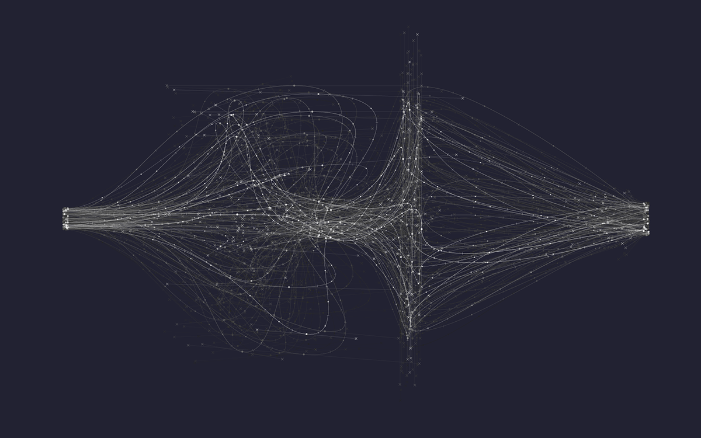

# Datasets 

Datasets collected for network science and machine learning research.

  

##### Contents  

1. [Deezer Social Networks](#deezer-social-networks)
2. [Facebook Page-Page Networks](#facebook-page-page-networks)  
3. [Wikipedia Article Networks](#wikipedia-article-networks)

## Deezer Social Networks

  

### Description

The data was collected from the music streaming service Deezer (November 2017). These datasets represent friendship networks of users from 3 European countries. Nodes represent the users and edges are the mutual friendships. We reindexed the nodes in order to achieve a certain level of anonimity. The csv files contain the edges - nodes are indexed from 0. The json files contain the genre preferences of users - each key is a user id, the genres loved are given as lists. Genre notations are consistent across users. In each dataset users could like 84 distinct genres. Liked genre lists were compiled based on the liked song lists. The countries included are Romania, Croatia and Hungary. For each dataset we listed the number of nodes an edges.

### Links

- [Romania](https://github.com/benedekrozemberczki/datasets/tree/master/deezer/RO/)
- [Croatia](https://github.com/benedekrozemberczki/datasets/tree/master/deezer/HR/)
- [Hungary](https://github.com/benedekrozemberczki/datasets/tree/master/deezer/HU/)

### Properties

- **Directed:** No.
- **Node features:** No.
- **Edge features:** No.
- **Node labels:** Yes. Multi-labeled.
- **Temporal:** No.

|   | **RO**  | **HR**  | **HU**  |
|---|---|---|---|
| **Nodes** |41,773   | 54,573  |  47,538 |
| **Edges** | 125,826  |498,202 |  222,887 |
| **Density** |  0.0001 | 0.0004  | 0.0002 |
| **Transitvity** | 0.0752| 0.1146 | 0.0929 |

### Possible Tasks

- **Node classification**
- **Link prediction**
- **Community detection**
- **Network visualization**

### Citing

If you find these datasets useful in your research, please cite the following paper:

>@misc{1802.03997,    
       author = {Benedek Rozemberczki and Ryan Davies and Rik Sarkar and Charles Sutton},    
       title = {GEMSEC: Graph Embedding with Self Clustering},   
       year = {2018},    
       eprint = {arXiv:1802.03997}
       }

## Facebook Page-Page Networks

  

### Description

We collected data about Facebook pages (November 2017). These datasets represent blue verified Facebook page networks of different categories. Nodes represent the pages and edges are mutual likes among them. The csv files contain the edges - nodes are indexed from 0. We included 8 different distinct types of pages. These are listed below. For each dataset we listed the number of nodes an edges.

### Links

- [Politicians](https://github.com/benedekrozemberczki/datasets/tree/master/facebook_page_page/politician/)
- [Companies](https://github.com/benedekrozemberczki/datasets/tree/master/facebook_page_page/company/)
- [Athletes](https://github.com/benedekrozemberczki/datasets/tree/master/facebook_page_page/sport/)
- [Media](https://github.com/benedekrozemberczki/datasets/tree/master/facebook_page_page/media/)
- [Public Figures](https://github.com/benedekrozemberczki/datasets/tree/master/facebook_page_page/public_figure/)
- [Artists](https://github.com/benedekrozemberczki/datasets/tree/master/facebook_page_page/artist/)
- [Government](https://github.com/benedekrozemberczki/datasets/tree/master/facebook_page_page/government/)
- [TV Shows](https://github.com/benedekrozemberczki/datasets/tree/master/facebook_page_page/tvshow/)

### Properties

- **Directed:** No.
- **Node features:** No.
- **Edge features:** No.
- **Node labels:** No.
- **Temporal:** No.

|   | **Nodes**  | **Edges**  | **Density**  | **Transitvity**|
|---|---|---|---|---|
| **Politicians**|  	5,908| 	41,729|0.0024|0.3011|
| **Companies**| 	14,113| 	52,310|0.0005|0.1532|
| **Athletes**| 		13,866| 	86,858|0.0009|0.1292|
| **News Sites**| 		27,917| 	206,259|0.0005|0.1140|
| **Public Figures**| 		11,565| 	67,114|0.0010|0.1666|
| **Artists**|  	50,515| 	819,306|0.0006|0.1140|
| **Government**| 		7,057|		89,455|0.0036|0.2238|
| **TV Shows**| 		3,892| 	17,262|0.0023|0.5906|

### Possible Tasks

- **Link prediction**
- **Community detection**
- **Network visualization**

### Citing

If you find these datasets useful in your research, please cite the following paper:

>@misc{1802.03997,    
       author = {Benedek Rozemberczki and Ryan Davies and Rik Sarkar and Charles Sutton},    
       title = {GEMSEC: Graph Embedding with Self Clustering},   
       year = {2018},    
       eprint = {arXiv:1802.03997}
       }
       
## Wikipedia Article Networks

  

### Description

The data was collected from the English Wikipedia (December 2018). These datasets represent page-page networks on specific topics (chameleons, crocodiles and squirrels). Nodes represent articles and edges are mutual links between them. The edges csv files contain the edges - nodes are indexed from 0. The features json files contain the features of articles - each key is a page id, and node features are given as lists. The presence of a feature in the feature list means that an informative noun appeared in the text of the Wikipedia article. The target csv contains the node identifiers and the average monthly traffic between October 2017 and November 2018 for each page.  For each page-page network we listed the number of nodes an edges with some other descriptive statistics.

### Links

- [Chameleons](https://github.com/benedekrozemberczki/datasets/tree/master/wikipedia/chameleon/)
- [Crocodiles](https://github.com/benedekrozemberczki/datasets/tree/master/wikipedia/crocodile/)
- [Squirrels](https://github.com/benedekrozemberczki/datasets/tree/master/wikipedia/squirrel/)

### Properties

- **Directed:** No.
- **Node features:** Yes.
- **Edge features:** No.
- **Node labels:** Yes. Continuous target.
- **Temporal:** No.

|   | **Chameleon**  | **Crocodile**  | **Squirrel**  |
|---|---|---|---|
| **Nodes** |2,277   | 11,631  |  5,201 |
| **Edges** | 31,421  |170,918 |  198,493 |
| **Density** |  0.012 | 0.003  | 0.015 |
| **Transitvity** | 0.314| 0.026 | 0.348 |

### Possible Tasks

- **Regression**
- **Link prediction**
- **Community detection**
- **Network visualization**

### Citing

If you find these datasets useful in your research, please cite the following paper:

>@misc{1802.03997,    
       author = {Benedek Rozemberczki, Carl Allen and Rik Sarkar},    
       title = {Multi-scale Attributed Embedding of Networks},   
       year = {2019}
       }
